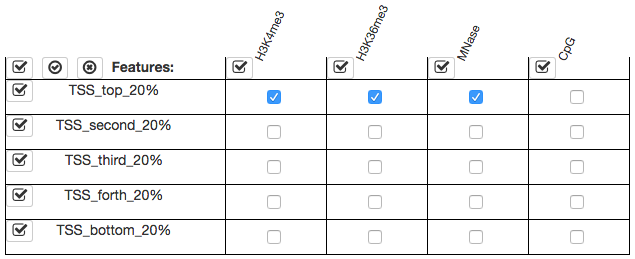
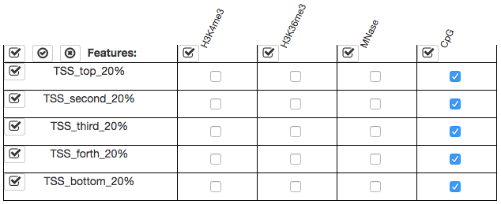
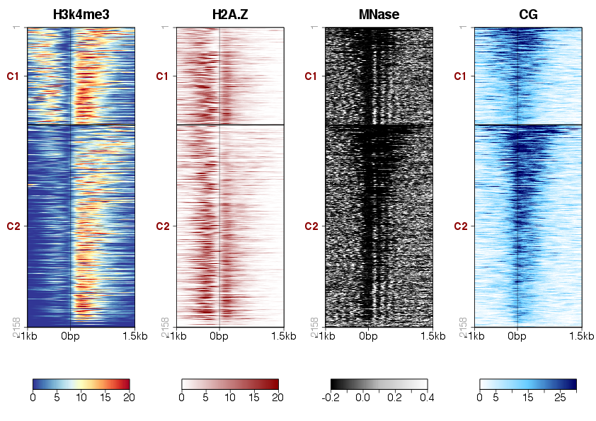

---
title: SeqPlots
author: Przemyslaw Stempor
framework: impressjs
#highlighter: highlight.js  # {highlight.js, prettify, highlight}
#hitheme: tomorrow  
#mode: draft
mode: selfcontained
--- #all x:600 y:300 scale:2.5

--- #a1 x:0050 y:-550 rot:0 z:0 scale:1

a

--- #b1 x:1150 y:-550 rot:0 z:0 scale:1

b

--- #a2 x:0000 y:0000 rot:0 z:0 scale:1

--- #b2 x:1100 y:0000 rot:0 z:0 scale:1

--- #c x:0000 y:0500 rot:0 z:0 scale:1

c

--- #d x:0000 y:1010 rot:0 z:0 scale:1

d

--- #e x:1100 y:0500 rot:0 z:0 scale:1

e

--- #f x:1100 y:1010 rot:0 z:0 scale:1

f

